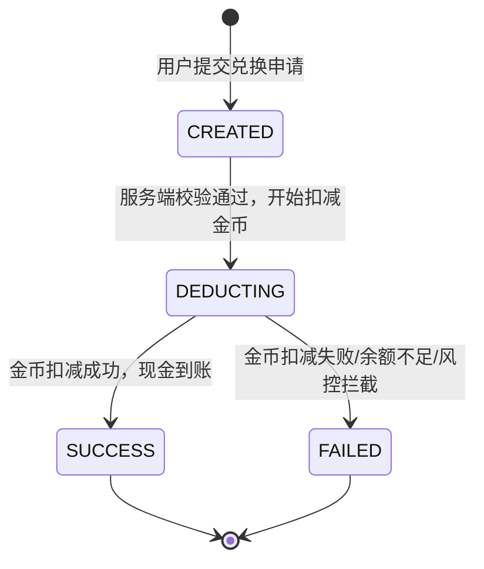
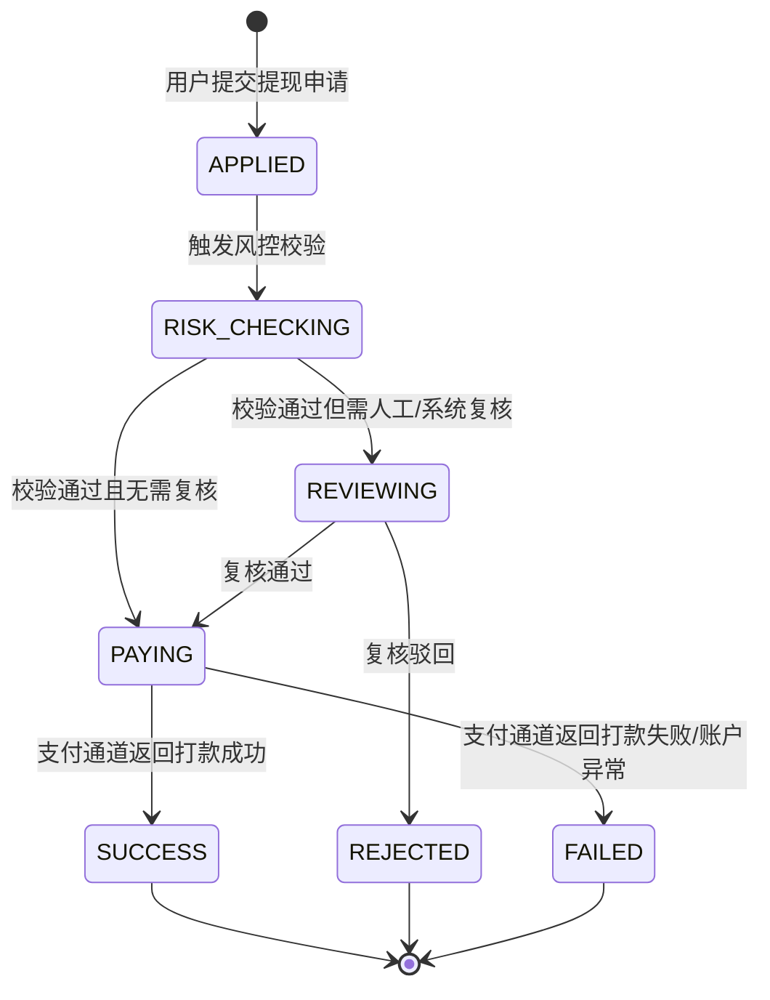

# Task 5：现金兑换与提现系统设计

## 1. 金币-现金兑换汇率与最低提现门槛

### 1.1 汇率方案对比

| 方案 | 说明 | 优点 | 缺点 | 推荐场景 |
|:---|:---|:---|:---|:---|
| 固定汇率 | 运营后台配置固定比例，如 10000 金币 = 1 元，全服统一 | 玩家感知稳定、易于财务核算、减少套利空间、实现简单 | 活动/拉新期间弹性不足，无法临时放大奖励感知 | **推荐本游戏采用** |
| 浮动汇率 | 根据用户留存、广告收益、活动周期动态调整，例如新用户首周 5000 金币 = 1 元 | 运营弹性大、可配合活动放大收益感 | 玩家信任成本高、易引发投诉、财务预测复杂、存在套利与合规争议 | 成熟平台大促/拉新活动 |
| 阶梯汇率 | 单次兑换量越大汇率越优惠，如 0.3 元档 12000:1，10 元档 10000:1 | 可激励用户累积后大额兑换 | 与最低门槛叠加后理解成本高，小额玩家体验差 | 可选补充实验 |

**推荐方案：固定汇率 + 运营后台可配置。**

- 默认汇率：10000 金币 = 1 元人民币。
- 配置生效规则：后台修改后仅对“新建兑换订单”生效，已创建订单按原汇率执行。
- 汇率精度：金币为整数，现金以“分”为最小单位；兑换金额 = floor(兑换金币数 / 当前汇率分母) × 汇率分母对应现金，再向下取整到分。
- 汇率变更审计：每次修改记录操作人、旧值、新值、生效时间，留档不少于 5 年。

### 1.2 最低提现门槛设计

采用三档门槛，兼顾拉新转化与成本可控：

| 档位 | 提现金额 | 对应金币 | 定位 | 风控策略 |
|:---:|---:|---:|:---|:---|
| 极速提现 | 0.30 元 | 3000 | 新用户首次提现、快速建立信任 | 仅限首次，需完成实名认证；每日限 1 次，额度计入日上限 |
| 常规提现 | 1.00 元 | 10000 | 日常小额兑换，提升活跃 | 需完成实名认证，受每日提现上限与时间窗口限制 |
| 大额提现 | 10.00 元 | 100000 | 降低高频小额打款成本 | 需完成实名认证，默认 T+1 审核，触发额外风控校验 |

**默认规则：**

- 新用户首提默认开放 0.30 元极速提现一次；首提后仅保留 1 元、10 元两档。
- 最低门槛可在运营后台按档位独立配置，支持 0.3 / 1 / 10 元组合或全部关闭。
- 每笔提现金额必须为对应门槛的正整数倍，例如 1 元档可提 1/2/3... 元，单次上限 200 元。

### 1.3 提现手续费承担方

- **默认由平台承担手续费**，用户到账金额 = 提现申请金额，不在前端展示手续费扣减。
- 后台配置中可开启“手续费由用户承担”模式，用于特定活动或大额场景；开启后需在产品页面明确告知用户。
- 平台承担时，财务将手续费计入运营成本；微信支付/支付宝实际费率按官方协议执行（通常企业付款到零钱 0.1%~0.6%，具体以签约为准）。

---

## 2. 兑换订单与提现申请状态机

### 2.1 兑换订单状态机

兑换订单负责将用户金币扣减并生成等值现金余额；兑换成功后，现金进入“可提现余额”。

状态说明：

| 状态 | 说明 |
|:---|:---|
| CREATED | 订单已创建，尚未执行金币扣减 |
| DEDUCTING | 正在扣减金币并增加可提现现金，事务进行中 |
| SUCCESS | 兑换成功，金币已扣减，现金已入账 |
| FAILED | 兑换失败，金币未扣减或已回滚，需向用户展示失败原因 |

### 2.2 提现订单状态机

提现订单负责将可提现现金通过支付通道打款至用户账户。

状态说明：

| 状态 | 说明 |
|:---|:---|
| APPLIED | 用户已提交提现申请，等待风控 |
| RISK_CHECKING | 正在进行自动风控校验（实名、设备、IP、频次、反作弊） |
| REVIEWING | 自动风控标记为“需复核”，进入人工/系统二次审核 |
| PAYING | 已调用支付通道，等待打款结果 |
| SUCCESS | 支付通道确认打款成功，现金已划出 |
| REJECTED | 审核驳回，现金退回用户可提现余额 |
| FAILED | 支付通道打款失败，现金退回用户可提现余额，用户可重新发起 |

### 2.3 关键状态流转约束

- 兑换订单与提现订单必须独立建单，一个兑换成功后可生成多笔提现。
- 从 APPLIED 到 SUCCESS/REJECTED/FAILED 必须保证“现金余额”与“支付通道”两边一致性；失败时现金退回需写入现金流水。
- 支付通道 30 分钟未返回终态，则进入“可疑”队列，由对账任务日终补齐状态；未终态订单不允许用户重复发起同金额提现。

---

## 3. 兑换与提现接口设计

### 3.1 通用约定

- 协议：HTTPS JSON API。
- 鉴权：请求头携带 `Authorization: Bearer <access_token>`。
- 幂等：所有写接口需携带 `idempotency_key`，服务端缓存 24 小时。
- 金额单位：现金统一为“分”，金币为整数“枚”。
- 通用错误码：

| 错误码 | 说明 |
|:---|:---|
| 0 | 成功 |
| 1001 | 参数错误 |
| 1002 | 未登录或 Token 失效 |
| 1003 | 系统繁忙 |
| 2001 | 金币余额不足 |
| 2002 | 可提现现金余额不足 |
| 2003 | 低于最低提现门槛 |
| 2004 | 超过单笔/单日提现上限 |
| 2005 | 未实名认证 |
| 2006 | 风控校验未通过 |
| 2007 | 账户被冻结或限制提现 |
| 2008 | 支付通道异常 |
| 2009 | 不在允许提现时间窗口 |
| 2010 | 重复请求 |

### 3.2 兑换申请

- **接口**：`POST /api/v1/cash/exchange`
- **功能**：将金币兑换为可提现现金。
- **请求参数**：

| 字段 | 类型 | 必填 | 说明 |
|:---|:---|:---:|:---|
| gold_amount | int | 是 | 兑换金币数量，必须为正整数且 ≥ 最小兑换单位 |
| idempotency_key | string | 是 | 幂等键，32~64 位随机字符串 |

- **响应字段**：

| 字段 | 类型 | 说明 |
|:---|:---|:---|
| code | int | 错误码 |
| message | string | 提示信息 |
| data.order_id | string | 兑换订单号 |
| data.gold_amount | int | 实际扣减金币 |
| data.cash_amount | int | 到账现金，单位分 |
| data.exchange_rate | string | 本次使用汇率，如 "10000:1" |
| data.status | string | 订单状态：SUCCESS / FAILED |
| data.created_at | string | 订单创建时间，ISO8601 |

- **核心校验**：金币余额 ≥ gold_amount；gold_amount 为汇率分母整数倍（如 10000 的倍数）；用户未处于冻结状态。

### 3.3 提现申请

- **接口**：`POST /api/v1/cash/withdraw`
- **功能**：将可提现现金申请打款至用户绑定支付账户。
- **请求参数**：

| 字段 | 类型 | 必填 | 说明 |
|:---|:---|:---:|:---|
| cash_amount | int | 是 | 提现金额，单位分，必须满足门槛与倍数要求 |
| channel | string | 是 | 提现渠道：wechat / alipay / bank |
| idempotency_key | string | 是 | 幂等键 |

- **响应字段**：

| 字段 | 类型 | 说明 |
|:---|:---|:---|
| code | int | 错误码 |
| message | string | 提示信息 |
| data.withdraw_order_id | string | 提现订单号 |
| data.cash_amount | int | 申请提现金额，单位分 |
| data.status | string | 订单状态：APPLIED / RISK_CHECKING / REVIEWING / PAYING / SUCCESS / REJECTED / FAILED |
| data.estimated_arrival | string | 预计到账时间描述，如 "预计 24 小时内到账" |
| data.created_at | string | 创建时间，ISO8601 |

- **核心校验**：已完成实名认证；cash_amount ≥ 当前档位门槛；不超过单日上限；在时间窗口内；channel 已绑定并通过校验；风控通过。

### 3.4 查询余额

- **接口**：`GET /api/v1/cash/balance`
- **功能**：查询金币余额、可提现现金、冻结中现金。
- **响应字段**：

| 字段 | 类型 | 说明 |
|:---|:---|:---|
| code | int | 错误码 |
| message | string | 提示信息 |
| data.gold_balance | int | 当前金币余额 |
| data.frozen_gold | int | 冻结中金币 |
| data.cash_balance | int | 可提现现金余额，单位分 |
| data.frozen_cash | int | 冻结中现金（审核/打款中），单位分 |
| data.total_withdrawn | int | 累计成功提现金额，单位分 |
| data.min_withdraw_config | object | 当前各档位门槛配置 |

### 3.5 查询订单列表

- **接口**：`GET /api/v1/cash/orders`
- **功能**：分页查询兑换与提现订单。
- **请求参数**：

| 字段 | 类型 | 必填 | 说明 |
|:---|:---|:---:|:---|
| order_type | string | 否 | 订单类型：exchange / withdraw，不传则全部 |
| status | string | 否 | 按状态筛选，多个用逗号分隔 |
| page | int | 否 | 页码，默认 1 |
| page_size | int | 否 | 每页条数，默认 20，最大 100 |
| start_time | string | 否 | 开始时间，ISO8601 |
| end_time | string | 否 | 结束时间，ISO8601 |

- **响应字段**：

| 字段 | 类型 | 说明 |
|:---|:---|:---|
| code | int | 错误码 |
| message | string | 提示信息 |
| data.total | int | 总记录数 |
| data.page | int | 当前页码 |
| data.page_size | int | 每页条数 |
| data.list | array | 订单列表，见 3.6 详情字段 |

### 3.6 查询订单详情

- **接口**：`GET /api/v1/cash/orders/{order_id}`
- **功能**：查询单条订单详情。
- **响应字段**（兑换订单）：

| 字段 | 类型 | 说明 |
|:---|:---|:---|
| code | int | 错误码 |
| message | string | 提示信息 |
| data.order_id | string | 订单号 |
| data.order_type | string | exchange |
| data.gold_amount | int | 兑换金币 |
| data.cash_amount | int | 到账现金，单位分 |
| data.exchange_rate | string | 汇率 |
| data.status | string | SUCCESS / FAILED |
| data.fail_reason | string | 失败原因，非空时展示 |
| data.created_at | string | 创建时间 |
| data.updated_at | string | 最后更新时间 |

- **响应字段**（提现订单）：

| 字段 | 类型 | 说明 |
|:---|:---|:---|
| code | int | 错误码 |
| message | string | 提示信息 |
| data.order_id | string | 订单号 |
| data.order_type | string | withdraw |
| data.cash_amount | int | 提现金额，单位分 |
| data.channel | string | wechat / alipay / bank |
| data.status | string | APPLIED / RISK_CHECKING / REVIEWING / PAYING / SUCCESS / REJECTED / FAILED |
| data.fail_reason | string | 失败/驳回原因 |
| data.estimated_arrival | string | 预计到账时间 |
| data.channel_transaction_id | string | 支付通道侧流水号，成功/失败时回填 |
| data.created_at | string | 创建时间 |
| data.updated_at | string | 最后更新时间 |

---

## 4. 支付通道接入方案

### 4.1 通道对比

| 通道 | 接入方式 | 适用场景 | 到账体验 | 主要限制 |
|:---|:---|:---|:---|:---|
| 微信支付企业付款到零钱 | 微信商户平台开通“企业付款到零钱”，调用 API 打款至用户微信零钱 | 小程序、App、H5 场景；用户微信授权登录 | 实时或数分钟内 | 需企业主体、商户号 90 天/30 天连续交易门槛、单笔/单日限额、IP 白名单 |
| 微信支付商家转账到零钱 | 新版接口，支持批量转账、附加转账说明、用户确认收款 | 中小额批量打款、需用户手动确认 | 用户需点击收款，24 小时未领退回 | 同样需要商户资质与交易门槛 |
| 支付宝转账 | 支付宝“单笔转账到支付宝账户接口”或“批量付款” | 用户已绑定支付宝账号 | 实时到账 | 需企业支付宝账号、签约转账产品、受风控限额 |
| 银行卡代付 | 通过第三方支付机构或银行代付接口，将资金打入用户银行卡 | 大额提现、用户未开通微信/支付宝 | T+0~T+1，需收集银行卡四要素 | 接入复杂、合规要求高、手续费较高 |

### 4.2 推荐方案

**优先接入微信支付企业付款到零钱（小程序/App 场景）。**

原因：

1. 目标用户以微信生态为主，授权登录后可直接获取 openid，打款链路短。
2. 到账体验接近实时，有利于用户口碑与留存。
3. 接口成熟、文档完善、对账数据完整。
4. 作为默认通道，覆盖 80% 以上提现请求。

**备选通道：**

- 支付宝转账：作为用户主动选择或微信通道异常时的兜底。
- 银行卡代付：仅对大额提现（如 ≥200 元）或特殊合规场景开放，后续按需接入。

### 4.3 微信支付企业付款接入要点

- 开通条件：企业主体、已认证商户号、满足官方交易门槛（以微信官方最新要求为准）。
- 关键接口：`mmpaymkttransfers/promotion/transfers`（企业付款到零钱）。
- 请求字段：mch_appid、mchid、nonce_str、sign、partner_trade_no、openid、check_name（NO_CHECK / FORCE_CHECK / OPTION_CHECK）、re_user_name、amount、desc、spbill_create_ip。
- 实名校验：建议 `check_name=FORCE_CHECK`，收款人姓名与实名认证姓名一致。
- 安全：API 证书妥善保存于服务端，禁止前端接触；IP 白名单仅添加服务端出口 IP。

### 4.4 支付回调处理

- 企业付款到零钱同步返回结果即可作为终态参考，但仍需配合对账文件进行二次确认。
- 服务端记录 `partner_trade_no` 与微信支付返回的 `payment_no`，作为对账唯一键。
- 若接口返回“处理中”或网络超时，订单进入 PAYING 状态，由定时任务 + 日终对账补齐状态，禁止直接置为失败。
- 收到明确失败结果（余额不足、openid 异常、用户未实名等）后，将提现订单置为 FAILED，现金退回用户可提现余额，并推送通知。

### 4.5 对账流程

1. **日终对账**：每日 10:00 前拉取微信支付/支付宝前一日对账单。
2. **三方对账**：将平台订单状态、支付通道流水、银行账户实际扣款进行三方比对。
3. **差异处理**：
   - 平台成功、通道未成功：人工复核后补打款或退款。
   - 平台失败、通道已成功：冻结异常资金，人工追损。
   - 金额不一致：标记差异，财务介入。
4. **对账表结构**：见第 6 节“财务对账表”。

---

## 5. 运营后台配置

### 5.1 配置项清单

| 配置项 | 默认值 | 说明 |
|:---|:---|:---|
| exchange_rate_gold | 10000 | 1 元现金对应金币数，如 10000 表示 10000 金币 = 1 元 |
| min_withdraw_tier_1 | 30 | 极速提现门槛，单位分，默认 0.30 元 |
| min_withdraw_tier_2 | 100 | 常规提现门槛，单位分，默认 1.00 元 |
| min_withdraw_tier_3 | 1000 | 大额提现门槛，单位分，默认 10.00 元 |
| max_withdraw_per_tx | 20000 | 单笔提现上限，单位分，默认 200 元 |
| max_withdraw_per_day | 50000 | 单日提现上限，单位分，默认 500 元 |
| withdraw_time_window_start | 09:00 | 允许提现开始时间 |
| withdraw_time_window_end | 21:00 | 允许提现结束时间 |
| withdraw_fee_bearer | platform | 手续费承担方：platform / user |
| withdraw_fee_rate | 0 | 用户承担时的手续费率，如 0.006 表示 0.6% |
| first_withdraw_tier_enabled | true | 是否允许 0.3 元极速首提 |
| review_threshold | 1000 | 超过该金额（分）自动进入人工/系统复核 |
| daily_global_withdraw_limit | 10000000 | 平台单日全局提现上限，单位分，用于熔断 |

### 5.2 配置生效规则

- 汇率与门槛修改即时写入配置中心，后续新建订单读取最新值。
- 已创建的兑换/提现订单不受后续配置变更影响。
- 关键配置变更需双人复核或记录操作日志，防止误操作。

### 5.3 后台管理页面建议字段

- 汇率管理：当前值、修改记录、生效时间。
- 门槛管理：三档金额、启用状态、单日/单笔上限。
- 时间窗口：提现开始/结束时间、节假日特殊配置。
- 手续费：承担方、费率、是否展示给用户。
- 全局熔断：单日平台提现总额、剩余额度、历史峰值。

---

## 6. 资金流水与审计

### 6.1 用户金币流水表

| 字段 | 类型 | 说明 |
|:---|:---|:---|
| flow_id | bigint PK | 自增主键 |
| user_id | bigint | 用户 ID |
| biz_type | varchar(32) | 业务类型：level_settle / task / sign_in / achievement / exchange / admin_adjust / punish |
| biz_id | varchar(64) | 业务单号，如兑换订单号 |
| change_gold | int | 变动金币数，正为增加，负为减少 |
| before_gold | int | 变动前余额 |
| after_gold | int | 变动后余额 |
| frozen_gold | int | 当前冻结金币 |
| source_id | varchar(64) | 来源会话/任务/成就 ID |
| idempotency_key | varchar(64) | 幂等键 |
| remark | varchar(255) | 备注 |
| created_at | timestamp | 创建时间 |

### 6.2 用户现金流水表

| 字段 | 类型 | 说明 |
|:---|:---|:---|
| cash_flow_id | bigint PK | 自增主键 |
| user_id | bigint | 用户 ID |
| biz_type | varchar(32) | 业务类型：exchange / withdraw / withdraw_refund / fee / admin_adjust |
| biz_id | varchar(64) | 业务单号 |
| change_cash | int | 变动现金，单位分 |
| before_cash | int | 变动前可提现余额，单位分 |
| after_cash | int | 变动后可提现余额，单位分 |
| frozen_cash | int | 冻结中现金，单位分 |
| channel | varchar(16) | 支付渠道，非提现场景可为空 |
| channel_transaction_id | varchar(64) | 支付通道流水号 |
| idempotency_key | varchar(64) | 幂等键 |
| remark | varchar(255) | 备注 |
| created_at | timestamp | 创建时间 |

### 6.3 财务对账表

| 字段 | 类型 | 说明 |
|:---|:---|:---|
| reconcile_id | bigint PK | 自增主键 |
| reconcile_date | date | 对账日期 |
| channel | varchar(16) | 支付渠道 |
| channel_transaction_id | varchar(64) | 通道流水号 |
| platform_order_id | varchar(64) | 平台订单号 |
| order_type | varchar(16) | exchange / withdraw |
| amount | int | 金额，单位分 |
| platform_status | varchar(16) | 平台记录状态 |
| channel_status | varchar(16) | 通道对账单状态 |
| bank_status | varchar(16) | 银行实际扣款状态 |
| diff_type | varchar(32) | 差异类型：none / amount_mismatch / status_mismatch / missing |
| diff_amount | int | 差异金额，单位分 |
| status | varchar(16) | 对账状态：pending / confirmed / handled |
| handler | varchar(64) | 处理人 |
| handled_at | timestamp | 处理时间 |
| created_at | timestamp | 创建时间 |

### 6.4 审计要点

- 所有金币、现金变动必须写入流水，禁止直接 UPDATE 余额而不记录流水。
- 流水与余额变动必须在同一数据库事务中完成。
- 每日对账差异必须在 T+1 工作日内处理完毕并留痕。
- 用户可查询近 180 天流水，运营后台可查询全量流水并导出。
- 涉及资金调整的运营操作需记录操作日志：操作人、时间、原因、前后值。

---

## 7. 合规注意事项

1. **反洗钱（AML）**
   - 首次提现前强制完成实名认证（姓名 + 身份证号），并与支付账户实名信息一致性校验。
   - 对短期内高频、大额、同一设备/IP/身份证多账户提现行为进行监控，触发二次验证或延迟打款。
   - 保留用户身份信息、交易流水、对账记录不少于 5 年，配合监管部门的反洗钱调查。
   - 建立可疑交易报告机制，对明显异常的交易及时向相关部门报告。

2. **税务合规**
   - 用户通过游戏获得的现金奖励可能构成个人所得，平台应在用户协议中明确告知用户需自行依法申报个人所得税。
   - 平台需就广告收入、支付手续费等支出取得合规发票，按实际经营情况申报增值税、企业所得税等。
   - 年度/累计提现超过一定金额（如 800 元）时，应在后台标记并考虑按劳务报酬代扣代缴个人所得税，具体以当地税务机关要求为准。

3. **用户协议与告知**
   - 在用户协议、提现页面显著位置披露：汇率规则、最低提现门槛、手续费承担方、预计到账时间、提现失败处理方式。
   - 明确平台有权根据风控、作弊、合规要求暂停或拒绝提现，并说明申诉渠道。
   - 未成年人账号应按照防沉迷及未成年人保护相关规定，限制或禁止提现功能。
   - 任何涉及资金的规则调整（如汇率、门槛）应提前公示，并对已生成订单保持原规则执行。

4. **支付合规**
   - 仅使用持牌支付机构或银行提供的官方接口，禁止无证从事支付业务。
   - 严格按照支付通道的准入条件、限额、用途说明接入，不得虚构交易背景。
   - 妥善保管 API 证书、密钥，实行最小权限访问，定期轮换密钥。

5. **数据与隐私**
   - 用户身份证、银行卡、openid 等敏感信息必须加密存储，传输使用 TLS。
   - 提现相关个人信息的使用目的、范围应在隐私政策中明确告知，并取得用户同意。
