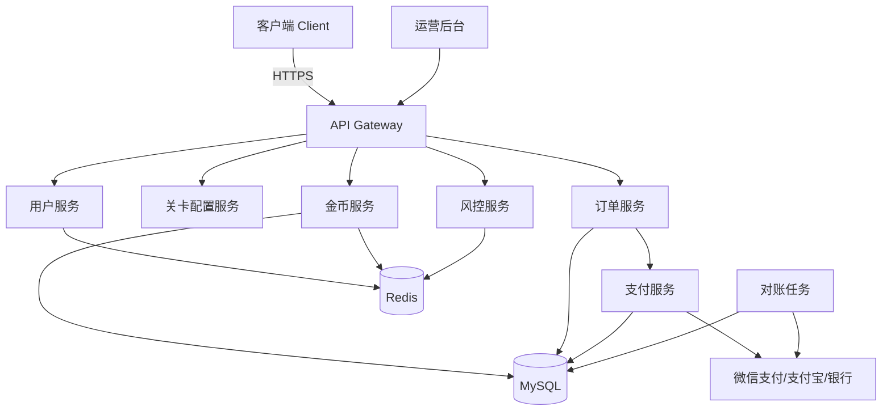

# Task 7：项目汇总文档

## 1. 项目概述

本项目是一款面向 18-45 岁休闲玩家的竖版平台跳跃闯关游戏，核心卖点为“闯关赚金币、金币兑现金”。玩家通过单指点击与滑动完成跳跃、二段跳和滑铲，在 3 大世界共 30 个关卡中收集金币、击败 Boss、挑战每日排行榜。游戏采用 Cocos Creator 3.x + TypeScript 跨平台开发，同时覆盖微信小游戏与 Android/iOS 双端，以广告变现补贴现金成本，并通过提现门槛、风控策略与合规流程保障业务可持续性。

## 2. 关键设计决策摘要

| 决策维度 | 关键决策 | 说明 |
|:---|:---|:---|
| 游戏类型 | 竖版平台跳跃闯关（自动前进） | 单手操作、单局 25-70 秒、碎片化体验友好 |
| 客户端技术 | Cocos Creator 3.x + TypeScript | 一次开发多平台发布，小游戏包体可控，热更新灵活 |
| 发布平台 | 微信小游戏 MVP，扩展 Android/iOS/抖音小游戏 | 先验证核心循环，再扩量至多平台矩阵 |
| 关卡规模 | 3 大世界 × 10 关 + 每日挑战 | 线性解锁，W2/W3 设置星级门槛形成成长目标 |
| 美术风格 | Q 版卡通，色彩明快，世界主题鲜明 | 参考 Super Mario Run / Fall Guys，全年龄段友好 |
| 金币经济 | 固定汇率 10000 金币 = 1 元 | 默认运营可配置，已创建订单按原汇率执行 |
| 最低提现门槛 | 0.30 元首提 / 1 元 / 10 元 三档 | 首提建立信任，后续小额日常 + 大额降成本 |
| 支付通道 | 微信支付企业付款到零钱为主，支付宝/银行卡兜底 | 微信生态优先，到账快、链路短 |
| 实名认证 | 微信/支付宝授权 + OCR 二要素兜底 | 首提前强制完成，未成年人禁止提现 |
| 风控等级 | 设备/IP/身份证/账号多维度限频 + 行为评分模型 | 0-100 分评分卡，自动分流打款/复核/拒绝 |
| 服务端架构 | Node.js / Go 微服务，MySQL + Redis，对象存储 CDN | 用户/关卡/金币/订单/支付/风控/运营后台分离 |

## 3. 技术架构概览

### 3.1 客户端

- **引擎**：Cocos Creator 3.x + TypeScript
- **平台**：微信小游戏、Android、iOS，后续可扩展抖音小游戏与 H5
- **模块**：登录授权、资源管理、关卡运行时、物理与碰撞、音效管理、广告 SDK 封装、支付/分享 SDK 桥接
- **性能目标**：微信小游戏首包 ≤ 4MB，纹理图集单张 ≤ 2048×2048，iOS/Android 原生包 ≤ 80MB

### 3.2 服务端

- **语言/框架**：Node.js（业务服务）或 Go（高性能结算/风控服务）
- **数据库**：MySQL 主库（用户、订单、流水、配置），Redis（缓存、限频、会话、排行榜）
- **存储/CDN**：对象存储承载资源包与图集，CDN 分发首包与动态资源
- **部署**：容器化（Docker/Kubernetes），网关统一鉴权与限流

### 3.3 关键服务

| 服务 | 职责 |
|:---|:---|
| 用户服务 | 注册/登录、游客转正、实名信息、账号状态、设备档案 |
| 关卡配置服务 | 关卡/敌人/障碍/星级配置管理，配置版本控制与 MD5 校验 |
| 金币服务 | 金币余额权威存储、结算校验、任务/签到/成就发放、流水审计 |
| 订单服务 | 金币兑换现金订单、提现订单状态机、幂等控制 |
| 支付服务 | 对接微信/支付宝/银行代付通道、对账、退款、回调处理 |
| 风控服务 | 反作弊校验、提现评分卡、设备指纹、黑名单、限频熔断 |
| 运营后台 | 汇率/门槛/时间窗口配置、订单查询、流水审计、客服工单 |

### 3.4 服务调用关系简图

## 4. 核心接口清单

| 接口名 | 方法 | 用途 |
|:---|:---:|:---|
| 用户登录/授权 | POST /api/v1/auth/login | 微信/游客登录，下发 access_token |
| 实名认证提交 | POST /api/v1/user/realname | 提交实名信息并完成二要素/授权校验 |
| 查询用户余额 | GET /api/v1/cash/balance | 返回金币余额、可提现现金、冻结金额 |
| 关卡配置拉取 | GET /api/v1/levels/config | 按版本拉取关卡 JSON 与 MD5 校验值 |
| 关卡会话创建 | POST /api/v1/levels/session | 开局申请 session_id，记录关卡版本与时间 |
| 关卡结算上报 | POST /api/v1/levels/settle | 上传单局结果，服务端校验并发放金币 |
| 每日任务列表 | GET /api/v1/tasks/daily | 返回今日任务进度与奖励状态 |
| 领取任务奖励 | POST /api/v1/tasks/claim | 领取每日任务/签到/成就奖励 |
| 金币兑换现金 | POST /api/v1/cash/exchange | 按汇率将金币兑换为可提现现金 |
| 提现申请 | POST /api/v1/cash/withdraw | 提交提现，触发风控与支付通道 |
| 订单列表查询 | GET /api/v1/cash/orders | 分页查询兑换/提现历史 |
| 订单详情查询 | GET /api/v1/cash/orders/{id} | 查询单条订单状态与详情 |
| 每日挑战排行榜 | GET /api/v1/rank/daily | 返回全服/好友排行榜与个人最佳 |
| 每日挑战提交 | POST /api/v1/rank/submit | 提交每日挑战得分，服务端校验后入榜 |
| 广告激励回调 | POST /api/v1/ads/reward | 激励视频观看完成后发放复活/翻倍/次数 |
| 运营后台配置更新 | POST /admin/v1/config | 修改汇率、门槛、时间窗口等运营参数 |

## 5. 开发排期与里程碑

假设团队 6-8 人（客户端 2-3 人、服务端 2 人、美术 1-2 人、策划/PM 1 人），总周期 3 个月。

| 阶段 | 周期 | 关键产出 | 依赖关系 |
|:---|:---|:---|:---|
| 阶段一：预研与原型 | 第 1-2 周 | 技术选型确认、Cocos Creator 工程搭建、微信登录/广告 SDK 接入验证、核心操作 Demo（跳跃/滑铲/碰撞） | 无 |
| 阶段二：核心玩法与关卡 | 第 3-6 周 | 完成 W1 10 关 + W2 10 关、关卡编辑器与配置导出流程、结算校验与金币发放、Boss 战通用框架 | 依赖阶段一工程框架与核心操作验证 |
| 阶段三：经济系统与提现 | 第 5-8 周 | 金币/现金余额服务、兑换与提现订单状态机、微信支付接入、风控评分模型、实名认证流程 | 依赖用户服务与金币服务；可与阶段二并行启动 |
| 阶段四：美术/UI/音效 | 第 6-10 周 | W3 场景与敌人、全部 UI 界面与动效、主角皮肤、VFX、BGM/SFX/环境音、多分辨率适配 | 依赖阶段二核心资源规范；W3 关卡需在阶段五前完成 |
| 阶段五：测试/合规/上线 | 第 9-12 周 | 全量关卡测试、性能压测、安全渗透测试、合规材料准备（用户协议/隐私政策/AML/税务）、微信审核、灰度发布 | 依赖前四个阶段全部核心功能完成 |

**里程碑节点：**

- M1（第 2 周末）：核心操作 Demo 可玩，技术方案与资源规范冻结。
- M2（第 6 周末）：W1 + W2 关卡 playable，金币结算与每日任务跑通。
- M3（第 8 周末）：兑换/提现/风控闭环完成，内部可走通首提流程。
- M4（第 10 周末）：W3 全部完成，美术资源基本到位，进入集成测试。
- M5（第 12 周末）：完成微信小游戏审核材料，开启灰度上线。

## 6. 风险与建议

| 风险类别 | 主要风险 | 缓解措施 |
|:---|:---|:---|
| 合规风险 | 现金奖励被认定为博彩/非法集资，或因未成年人保护、反洗钱不合规被处罚 | 首提前强制实名，未成年人禁止提现；建立 AML 内控与可疑交易报告机制；用户协议明确现金奖励性质与税务义务 |
| 支付风险 | 微信支付商户号准入门槛不满足，或提现被平台风控拦截 | 提前 90 天准备企业主体与交易流水；备选支付宝/银行代付通道；大额订单人工复核 |
| 反作弊风险 | 玩家使用脚本、修改器、云手机批量刷金币与提现 | 服务端权威结算 + 客户端内存加密/签名校验；行为评分模型；设备/IP/身份证限频；作弊收益清零与封号 |
| 经济平衡风险 | 金币产出过高或兑换率失控，导致现金成本超过广告收入 | 固定汇率 + 后台可配置；预设理论最大产出；日终监控单 DAU 现金负债；通过门槛与兑换率调控 |
| 留存风险 | 玩家首提后流失，或长期无法达到提现门槛导致挫败 | 0.30 元首提建立信任；每日任务与签到提供稳定产出；每日挑战与排行榜提升长期目标感 |
| 广告变现风险 | eCPM 低于预期或广告填充不足，无法覆盖现金成本 | 接入多家广告平台竞价；控制人均广告展示次数避免过度打扰；敏感性分析预留亏损预案 |
| 技术稳定性风险 | 高并发结算/提现导致数据库性能瓶颈或资金重复发放 | 乐观锁 + 幂等键 + 分布式锁；Redis 限流；核心资金操作使用事务；日终对账补齐异常状态 |
| 审核上线风险 | 微信小游戏/应用商店对“提现”“赚钱”类玩法审核严格 | 提前阅读最新平台政策；避免诱导分享与虚假到账宣传；准备完整的用户协议与隐私政策 |
| 用户体验风险 | 跨机型触控不一致、包体过大导致加载流失 | 多机型触控测试与阈值调优；资源分包 + 纹理压缩；首包控制在 4MB 以内 |
| 外包/美术风险 | 外包资源风格不统一或交付延期影响排期 | 风格 moodboard 先行；主美严格审核；核心角色与 UI 内部把控；预留 10% 时间用于 polish |

## 7. 下一步行动清单

1. **召开项目启动会**：明确团队分工、里程碑与每日/每周同步机制，确认技术栈与发布平台优先级。
2. **搭建 Cocos Creator 3.x 工程框架**：完成微信小游戏 + Android/iOS 构建流水线、资源分包方案与热更新机制。
3. **输出原型 Demo**：实现角色自动前进、跳跃、二段跳、滑铲、碰撞死亡与结算，验证核心操作手感。
4. **设计并冻结关卡编辑器配置规范**：确定 Excel 转 JSON 流程、关卡实体放置表结构与版本校验机制。
5. **完成服务端基础服务搭建**：用户服务、金币服务、关卡配置服务、MySQL/Redis 表结构、API 网关鉴权。
6. **接入微信登录与广告 SDK**：完成游客登录、授权登录、激励视频、插屏广告封装与回调验证。
7. **准备企业主体与支付通道**：注册公司、申请微信商户号与支付宝企业账号，确认企业付款到零钱准入条件。
8. **起草法律文件**：委托法务/合规律师起草用户协议、隐私政策、未成年人保护条款、反洗钱与税务说明。
9. **制定风控规则初版**：明确设备/IP/身份证限频阈值、异常行为判定标准与处置措施，写入运营后台可配置项。
10. **启动美术风格预研**：输出 moodboard、主角草图、W1 概念色稿与 UI 风格指南，确定外包合作方。

---

## 交付物文件路径索引

- Task 1 核心玩法与技术方案：`/workspace/.trae/specs/design-casual-level-game-with-cash-redeem/deliverables/01-core-gameplay.md`
- Task 2 关卡体系与数值设计：`/workspace/.trae/specs/design-casual-level-game-with-cash-redeem/deliverables/02-level-design.md`
- Task 3 美术资源清单与风格规划：`/workspace/.trae/specs/design-casual-level-game-with-cash-redeem/deliverables/03-art-assets.md`
- Task 4 金币经济系统设计：`/workspace/.trae/specs/design-casual-level-game-with-cash-redeem/deliverables/04-economy.md`
- Task 5 现金兑换与提现系统设计：`/workspace/.trae/specs/design-casual-level-game-with-cash-redeem/deliverables/05-cash-redeem.md`
- Task 6 合规与风控方案：`/workspace/.trae/specs/design-casual-level-game-with-cash-redeem/deliverables/06-compliance-risk.md`
- Task 7 项目汇总文档：`/workspace/.trae/specs/design-casual-level-game-with-cash-redeem/deliverables/07-summary.md`
